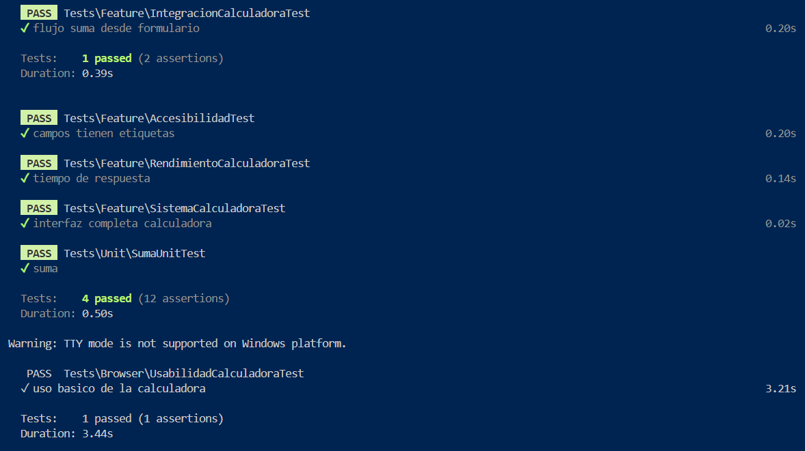

# Calculadora Laravel con Pruebas en Laravel Dusk

Este proyecto implementa una calculadora básica en Laravel y utiliza Laravel Dusk para realizar pruebas automatizadas de navegador.

## Requisitos Previos

Asegúrese de contar con lo siguiente instalado en su sistema:

- PHP 8.3 o más
- Composer
- npm 
- Google Chrome instalado
- Un servidor de desarrollo (Laravel Sail, XAMPP, Laragon, o `php artisan serve`)
- Extensiones remotas habilitadas en Chrome

## Instalación del Proyecto

1. Clonar el repositorio:

```bash
git clone https://github.com/tu-usuario/calculadora-laravel.git
cd calculadora-laravel
composer install
cp .env.example .env
php artisan key:generate
composer require --dev laravel/dusk


## Correr el proyecto

En una terminal usar el driver de chrome
./vendor/laravel/dusk/bin/chromedriver-win.exe --port=9515
## en otra terminal usar 
php artisan serve
## Y en la tercera terminal ejecutar las pruebas

Ejecutar todas las pruebas de navegador:

# 1. Tests Unitarios
php artisan test --testsuite=Unit
# 2. Tests de Integración
php artisan test --testsuite=Feature
# 3. Tests de Interfaz
php artisan dusk
## En caso de errores relacionados con certificados (por ejemplo, cURL error 77), descargar el archivo cacert.pem desde:

https://curl.se/ca/cacert.pem

Colocarlo en un directorio conocido, como:

C:\Program Files\php\extras\ssl\cacert.pem

## y en php.ini actualizar estas properties 

curl.cainfo = "C:\Program Files\php\extras\ssl\cacert.pem"
openssl.cafile = "C:\Program Files\php\extras\ssl\cacert.pem"




